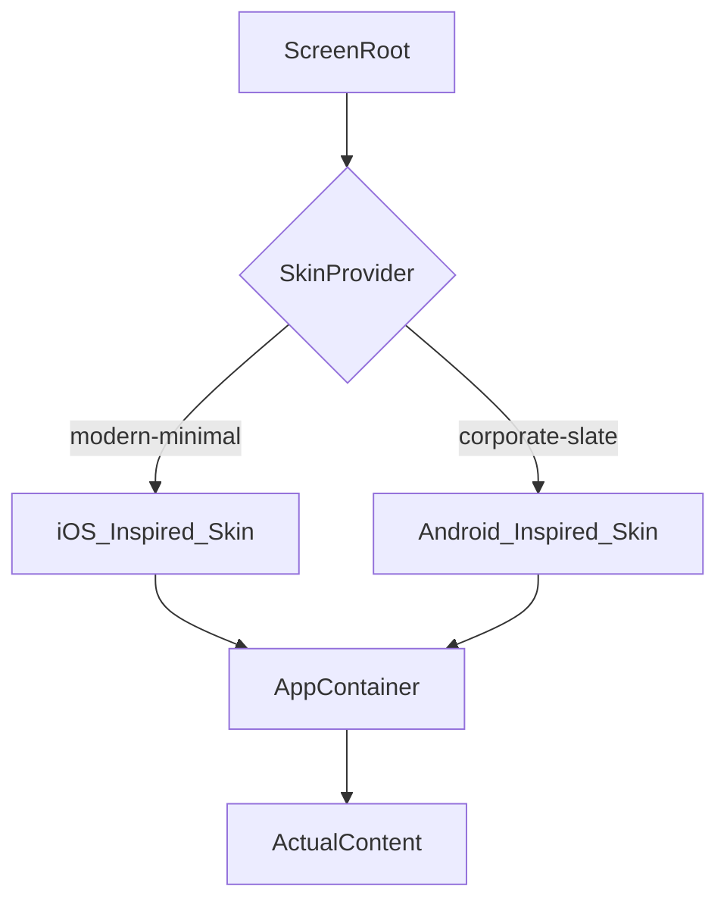

# SOP: Skin Rendering

This document defines how Receiver devices interpret `DeviceState` to render different "Skins" (OS types, brands, and layouts).

## 1. Skin Mapping

The `skin` property in `DeviceState` dictates which UI-Shell wrap is used by the Receiver.

| Value | Target Brand | Visual Style |
|---|---|---|
| `modern-minimal` | Generic High-End | Minimalist, Glassmorphism, Rounded |
| `corporate-slate` | Business/Enterprise| High Contrast, Sharp Edges, Blue tones |
| `retro-terminal` | Legacy/Industrial | Monospaced, Amber/Green phosphor |
| `youth-vibrant` | Social/Consumer | Gradient-heavy, High saturation |

## 2. Architecture (Layering)

Receiver rendering follows a 3-layer stack:

1. **Base Layer (Shell)**: The OS interface (Status bars, Home buttons, Lock screen).
2. **Middleware (App)**: The current active application (Messenger, Camera, Phone).
3. **Dynamic Layer (Content)**: Specific data emitted by Cues (Text messages, Caller ID).

## 3. Component Hierarchy

## 4. Design Guidelines

- **High Contrast**: All text must be readable under harsh set lighting.
- **Responsive Shell**: Shells must adapt to both Portrait (Phones) and Landscape (Tablets/TVs) without breaking OS metaphors.
- **Transitions**: Use `framer-motion` for smooth app switching to maintain the illusion of a native OS.
